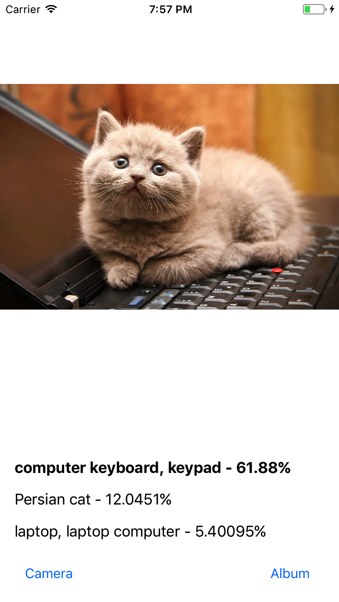

# CoreML Vision Example

Using the Apple's new [Core ML](https://developer.apple.com/documentation/coreml) and [Vision](https://developer.apple.com/documentation/vision) frameworks for iOS 11 along with the [Inception V3 model](https://developer.apple.com/machine-learning/), I have created a basic app, demoing how easy it is to impliment image recognition.

After selecting an image or using the devices camera to capture, the app will then display three predictions as to what the photo contains.

*Requires XCode 9*

